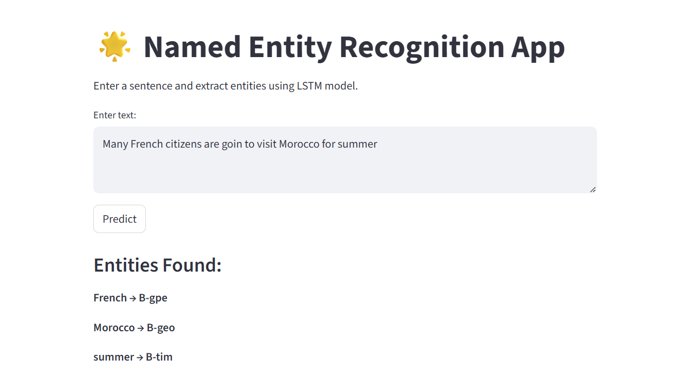
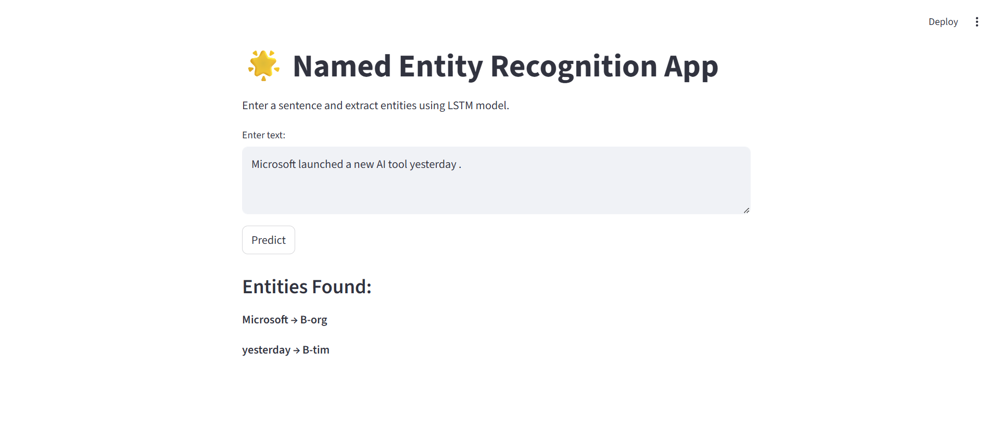
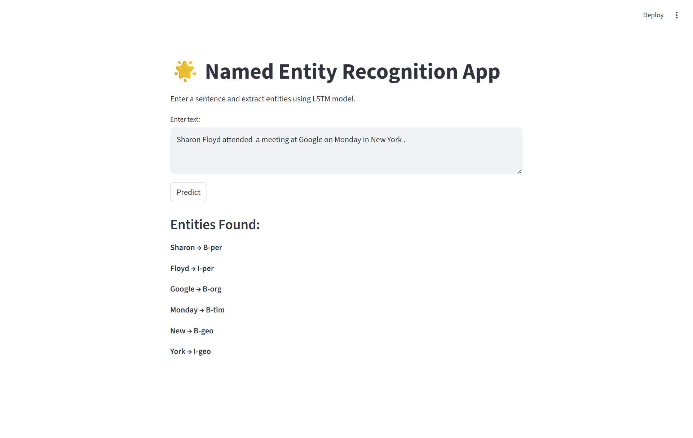

# Named Entity Recognition (NER) Project

## Project Overview

This project implements a **Named Entity Recognition (NER)** system using **LSTM neural networks**.  
It can identify entities like **Person, Organization, Location, Date, Event**, etc., from raw text sentences.

The model is trained on a large NER dataset and can recognize entities in new sentences for NLP applications.  
The model achieved a **masked accuracy of 95.85%** on the test set.

---

## Model Architecture

The model uses an **Embedding → LSTM → Dense** architecture with **masked loss** to handle padded sequences.

- **Embedding Layer:** Converts words into dense vectors, capturing semantic meaning.  
- **LSTM Layer:** Captures sequential dependencies in sentences, allowing the model to understand context.  
- **Dense Layer:** Predicts entity tags for each token.  
- **Custom Masked Loss & Accuracy:** Ignores padded tokens (`-1`) during training and evaluation to ensure accurate metrics.

---

## BIO Tagging Scheme

- `B-` → Beginning of an entity  
- `I-` → Inside an entity  
- `O` → Outside an entity  

### Entity Types

- `PER` → Person  
- `ORG` → Organization  
- `LOC` / `GPE` → Location  
- `ART` → Artifact  
- `TIM` → Time  
- Others: `EVE` (Event), `NAT` (Natural object), etc.

---

## Outputs

  
  

---

